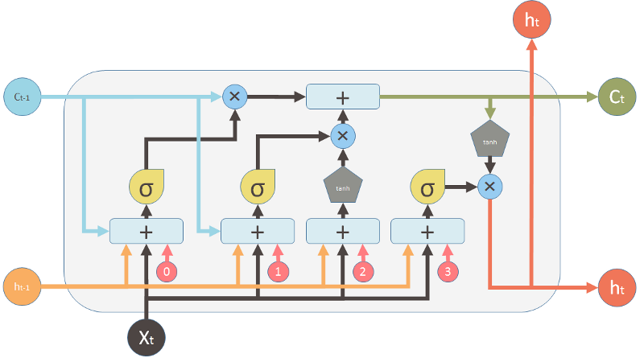
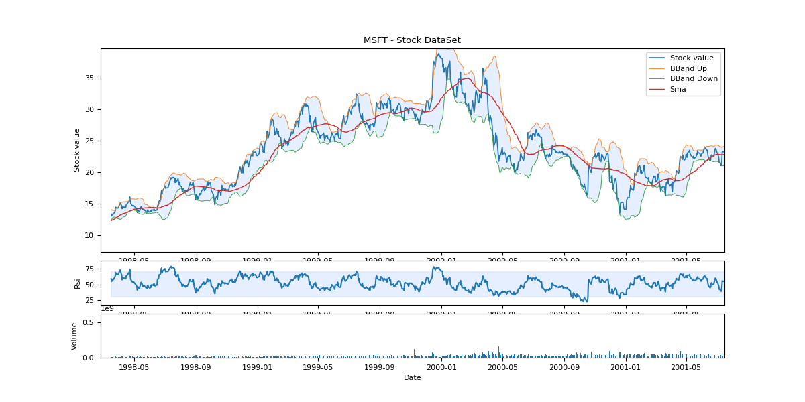

# Time series prediction and strategies on stock markets - Machine learning a.a. 2018/19

## Index
1. [Introduction](#introduction)
2. [Script](#script)
    1. [Utilized library](#utilized-library)
    2. [Usage](#usage)
    3. [Files and folders](#files-and-folders)
    4. [Config file (json)](#config-file-json)
3. [LSTM](#lstm)
4. [LSTM architectures](#lstm-architectures)
5. [TrainingSet](#trainingset)
    1. [Normalisation](#normalisation)
6. [Prediction(s)](#predictions)
7. [Predict periodic functions](#predict-periodic-functions)
    1. [Results](#results)
8. [Stock Market](#stock-market)
    1. [What It Do](#what-it-do)
    2. [Indicators (Technical Analysis)](#indicators-technical-analysis)
    3. [Trading Strategies](#trading-strategies)
    4. [The (best) Strategy](#the-best-strategy)
    5. [A New Metric: Profit](#a-new-metric-profit)
    6. [Results](#results-1)
    7. [Others Stocks](#others-stocks)
9. [Conclusions](#conclusions)    
10. [Bibliography](#bibliography)
                   

## Introduction

Come noto prevedere l'andamento di *titoli, indici, commodities* (etc..) è *il Santo Graal* per molti appassionati 
 ed adetti ai lavori, ma non solo. Riuscire a prevedere con relativa certezza, o con un margine di errore inferiore al 50% (ie. *profitto*) l'andamento della borsa 
rimane il sogno di molti. 

Azioni, indici, valute, materie prime, altro non sono che **time series**, ovvero un valore che muta durante il tempo.
Possono essere considerate **monodimensionali** se si prende in considerazione il solo valore (o cambio nel caso delle valute), 
o **multidimensionali** se consideriamo nella *serie* altri parametri come il **volume delle transazioni** e/o gli **indicatori statistici**.  

In questo progetto si cercherà di **prevedere** (o capire quanto è difficile farlo) l'andamento delle azioni (e non solo) nei mercati azionari. 

In realtà, lo scopo ultimo, non sarà unicamente quello di fare previsioni sul futuro andamento del valore, ma anche di confrontare alcuni 
**indicatori** messi a disposizione dell'**Analisi Tecninca** con quelli *"generati"* attraverso una rete di **LSTM** (*Long Short Term Memory*). 

Ed infine mettere a punto una **strategia di trading** (attraverso una rete neurale) che ottimizzi i risultati di investimento.

## Script

Vediamo, a grandi linee, com'è strutturato e come è possibile utilizzare lo script. 

### Utilized library

Le librerie utilizzate sono:

* **keras**: creazione e gestione delle reti neurali (framework basato su *TensorFlow*)
* **sklearn**: encoding, metriche e modelli di classificatori
* **talib**: calcolo degli *indicatori* statistici sugli andamenti azionari (*Analisi Tecnica*)
* **alpha_vantage**: servizio online che fornisce dati (storici e non) sull'andamento dei titoli
* **numpy**: gestione avanzata si serie e matrici
* **pandas**: gestione dei DataSet (come DataFrame)
* **matplotlib**: grafici
* **json**: decodifica json per file di configurazione
* **logging**: gestione dei logs
* **argparse**: command line (cli) argument parsing
* **hashlib**: rileva eventuali modifiche al file di configurazione (attraverso l'hashing MD5)
* **typing**: python support per *type hints* (check sui parametri di funzione per cardinalità e tipo)
* **os**: operazioni sul filesystem

Il codice è ispirato al progetto di `Jakob Aungiers` reperibile su [github](https://github.com/jaungiers/LSTM-Neural-Network-for-Time-Series-Prediction).

### Usage

```bash
main.py [-h] [--in-memory-training] [--symbol-data-overwrite] [--force-train] CFG_FILENAME
```

* **CFG_FILENAME**: path_string - path al file di configurazione
* **--in-memory-training, -m**: prepara preventivamente tutto il TrainingSet in memoria (sconsigliato). Default *False* 
* **--symbol-data-overwrite, -d**: sovrascrivere il *DataSet* (storico andamento titolo) già scaricato. Default *False*
* **--force-train, -f**: forza il retraining del modello *LSTM*

> **nota**: la maggior parte delle opzioni sono modificabili attraverso il file di configurazione (che [vedremo dopo](#config-file-json))

### Files and folders

Il programma è strutturato in diversi files e cartelle:

* **cfg**: qui sono presenti i file di configurazione in formato **json**, uno per ogni azione (market stock).
* **data_set**: qui verranno salvati i *DataSet* ottenuti dal servizio *"cloud"* ([alphavantage](https://www.alphavantage.co/)).  
Questo evita di ri-interrogare ogni volta le API remote, consentendo anche il lavoro offline
* **libs**: librerie (package) utilizzati dall'applicativo:
    * **data_processor.py**: prepara, manipola e suddivide il *DataSet* per il training della rete neurale
    * **model.py**: compila, salva, carica, allena il modello LSTM (`LSTMModel`)ed infine lo utilizza per effettuare le previsioni
    Gestisce anche i modelli applicati sulle strategie (`StrategyModel`)
    * **stock_data.py**: carica gli andamenti dei titoli da *alphavantage*, li salva su csv, li manipola,
     calcola gli indicatori e li visuallizza su grafico 
    * **stock_strategies.py**: genera strategie di trading basate sulle previsioni e gli indicatori 
    * **utils.py**: classi e funzioni di utilizzo generico (calcolo del tempo, disegno di grafici, etc...)
* **saved_models**: qui vengo salvati i modelli delle reti neurali (per ogni stock market), una volta effettuata la compilazione e l'allenamento
* **main.py**: entry point del programma e work flow primario

> **nota**: il nome della *saved_models* è indicato nella configurazione (`model > save_filename`)

> **nota**: il programma riconosce in automatico quando è possibile utilizzare un modello salvato o è necessario effettuare 
di nuovo tutto processo di training, a fronte di una modifica nel file di configurazione. 

### Config file (json)

Il file è suddiviso in 3 macrosezioni: 
* **data**: dove troviamo informazioni sul **DataSet** (ie. preparazione del *TrainingSet*)
    * *symbol*: codice univoco dell'azione o `function` nel caso di semplice funzione (eg. coseno, seno, etc...)
    * *filename*: dove verranno salvate le informazioni (file csv)
    * *interval*: indica la *"frequenza di campionamento"* del valore (1min, 5min, 15min, 30min, 60min, 1d)
    * *index_col*: la colonna da usare come indice (eg. date) o null per un intero *"auto-incrementale*"
    * *start_from* / *end_to*: l'intervallo dell'indice da prendere,
    * *indicators*: gli **indicatori** statistici da calcolare e i relativi parametri (eg. *sma, rsi, bbands*) 
    * *columns*: le **features** in input  che verranno date al modello **LSTM** (eg. *close, volume, sma, rsi, bbands*)
    * *len_train_window*: la **finestra di training** utilizzata +1 (valore da predirre)
    * *train_test_split*: la porzione di *DataSet* che verrà utilizzata per il training
    * *normalise*: abilita (o disabilita) la **normalizzazione** dell'input (ie. *columns*) 
* **training**: questa sezione indica i parametri di *Keras* da utilizzare durante il training del modello (eg. *epochs, batch_size*)
* **model**: qui troviamo la struttura della rete neurale (con i sui **hyperparameters**): 
    * *loss*: **optimization score function**, la funzione che ritornerà l'errore che vogliamo ottimizzare (eg. *mean squared error*)
    * *optimizer*: metodo per l'aggiornamento dei pesi del modello (eg. *adam, RMSprop, Adamax*)
    * *save_filename*: il nome del file dove verrà salvato il modello compilato e allenato
    * *layers*: è un array/lista con la definizione dei vari layers del modello (eg. numero neuroni, tipo)
        * *type*: tipo di neurone (eg. *lstm*, *dropout*, etc...)
        * *neurons*: numero di neuroni nel layer. Ogni cella *LSTM* ha `N` neuroni e in ogni momento lo 
        *stato della cella* è un vettore di dimensione `N`
        * *input_timesteps*: è relativo al tipo *LSTM* ed indica il numero di valori necessari a fare una previsione (*window*),
         ovvero il numero di blocchi *LSTM* presenti nell'input layer
        * *input_dim*: il numero di features in ingresso (vettore di input), che coinciderà con `len(columns)`. 
        Insieme a *input_timesteps* crea l'*input_shape* del modello
        * *return_seq*: ritorna la sequenza completa di output (per il layer successivo) o solo l'ultimo output (utilizzato nel layer finale)
* **strategy_model**: configurazione dei modelli applicati alla *"classificazione"* delle strategie
    * *mlp*: configurazione del Multilayer perceptron
    * *random_forest*: configurazione della Random Forest
    * *train_test_split*: la porzione di *DataSet* (ovvero il *TestSet* *"arricchito"* del modello LSTM) che verrà utilizzata per il training

> **nota**: alcune informazioni su *neurons*, *input_timesteps*, *len_train_window*, *input_dim*, *return_seq*, etc 
verranno approfondite in [LSTM](#lstm) e [LSTM architectures](#lstm-architectures)     
    
> **nota**: per maggiori dettagli consultare il metodo `build_model()` in `model.py` e la [documentazione di keras](https://keras.io/layers/recurrent/)

## LSTM

Il core del programma rimangono le **LSTM** (Long Short Term Memory), ovvero un tipo *"speciale"* di **RNN** 
in grado di apprendere dipendenze a **lungo termine**.

Noi esseri umani non impariamo da zero ogni volta, anche leggendo questo testo diamo il significato di una parola basandoci 
su quelle precedenti (una sorta di persistenza nel pensiero).

Le *"tradizionali"* reti neurali (eg. *MLP*) non tengono conto del passato per dare un *"significato*" al presente, ecco perchè
esistono le **RNN** che grazie a un **loop** (retro-feedback) permettono alle informazioni di *"persistere"* nel tempo. 

Il *loop* può sembrare qualcosa di complesso, ma (come si vede nell'imagine 1) è facile pensare una *RNN* (sinistra) in una
normale neural network (destra) formata da copie della stessa rete, ognuna delle quali passa un messaggio alla successiva (**unrolled loop**).

                      |
------------------------------------------------|
Unrolled (Time Unfolding) della RNN *(1)*       |

L'immagine fa anche capire come le *RNN* siano strettamente collegate alle **serie/sequenze** in input.

Il limite delle **RNN** sta nella capacità di effettuare delle previsioni su un contesto lontano (nella sequenza), ed è qui
che entrano in gioco le **LSTM**, esplicitamente sviluppate per *"ricordare"*, tenendole in considerazione, informazioni lontane.

                    |                    |
-------------------------------------------|--------------------------------------------|
Catena di **RNN** e visione interna *(2)*  |Catena di **LSTM** e visione interna *(3)*  |

Un nodo *RNN* è un *singolo layer di una neural network* con funzione di *tangente iperbolica* (`tanh`). Questo è collegato all'input, 
al nodo precedente, quello successivo e all'uscita.

Una *LSTM* è invece composta da 4 *single neural network layer* che interagiscono fra loro (rettangoli gialli img. *3*).

Guardando all'interno di un singolo nodo possiamo vedere nel dettaglio il seguente diagramma:

                |                |
-------------------------------------------------|--------------------------------------------------|
Diagramma di funzionamento di una **LSTM** *(4)* |Legenda della notazione usata nel diagramma *(5)* |

Dove ogni linea porta un intero vettore e vi applica delle *pointwise operations*/*vector operations* di moltiplicazione e addizione. 
 
La linea della cella che corre in cima al diagramma, viene chiamata **cell state**, questa *"trasporta"* l'informazione (la memoria)
lungo la catena. Ovviamente il nodo ha la possibilità di rimuovere o aggiungere informazioni allo *stato della cella* attraverso i **gates**.

Suddividiamo e analizziamo il comportamento di una *LSTM* in 3 fasi, ognuno relativo ad un singolo **gate**:

Fase / Gate  | Descrizione               |
------------------------------|--------------------------------------------|
     |Il primo formato da un *sigmoid layer* (uscita tra 0 e 1) vine chiamato **forget gate**, e decide quanto e quale **cell state** deve passare (1 passerà tutto, 0 non passerà nulla), come una sorta di valvola sulla memoria (*Ct-1*). *(6)* |
     |Il secondo gate viene chiamato **new memory gate** o **input gate** ed è formato da un un **forget gate layer** e **tanh layer** (che vincola l'uscita tra -1 e 1). Il primo controlla quanto e quale valore (moltiplicazione) della *"nuova memoria"* (*Xt*) dovrà influenzare la *"vecchia*" (*Ct-1*). Il **tanh layer** creerà il vettore di candidati (della nuova memoria) che sarà aggiunto (addizione pointwise), aggiornando lo stato. *(7)* |
     |Alla fine dobbiamo decidere quale sarà il nostro output (input della prossima cella). Questo sarà una versione *"filtrata"* dello stato della cella attraverso il solito **forget gate layer**, sempre controllato dal precedente output (*ht-1*) e dal corrente input (*Xt*). Il tutto prende il nome di **output gate**. *(8)* |

## LSTM architectures

Le classiche **Artificial neural network**, possono essere applicate **soltanto** a vettori di dimensioni fissate in input 
e produrre vettori di dimensioni fissate in output, oltre ad eseguire un numero fissato di step per il calcolo del risultato (eg. *MLP*).  

Le **Recurrent Neural Networks** (comprese le *LSTM*), possono fare previsioni su *sequenze di vettori* in input od ottenere *sequenze di vettori* in output od entrambi.

Questo si ottiene con le diverse configurazioni dei blocchi *RNN* all'interno della rete neurale:

            |
--------------------------------------------|
Architetture delle *RNN* *(9)*              |

Nell'immagine *(9)* ogni rettangolo rappresenta un vettore. L'input è in *rosso*, l'output è in *blue* e il *verde* rappresenta il vettore di 
stato della *RNN*.  

Da sinistra a destra:
1. Non è una *RNN*, abbiamo un classico esempio di di rete neurale con *fixed-input* e *fixed-output* (eg. *MLP*).
2. Sequenza in uscita (eg. prende in ingresso un immagine e produce una frase in uscita)
3. Sequenza in ingresso (eg. classifica una frase in ingresso)
4. Sequenza in ingresso ed in uscita (eg. legge una frase in Inglese e ne produce una in Italiano)
5. Ingresso ed uscita sincronizzati (eg. aggiungere una label ad ogni frame di un video)  

Nel nostro progetto useremo la *3* **many to one** e la *5* **many to many** in un architettura multilayer.    
I bocchi rossi (input) definiranno il nostro **input_timesteps** (vedi [Config file (json)](#config-file-json)), ovvero la lunghezza della nostra 
**finestra di previsione**.

> **nota**: il numero dei blocchi rossi coincide sempre con il numero dei blocchi verdi in **keras**.

La differenza tra la struttura *3* e la *5*, è ottenuta in **keras** grazie al parametro **return_seq** nel nostro config file.  
Quando è *False* il layer *LSTM* invierà in output l'uscita dell'ultima nodo, ottenendo una **many to one**, che noi utilizzeremo 
nell'ultimo layer di uscita.  
Al contrario nel primo layer ed in quelli interni, imposteremo **return_seq** a *True*, ottenendo una **many to many**, che passerà 
la sequenza degli output al layer successivo.

> **nota**: **input_dim** non è strettamente legato alla struttura della rete, ma indica la dimensione del vettore di input (input multi-dimensionale)

## TrainingSet

Data la natura delle *LSTM* e gli *hyperparameters* collegati, il **TrainingSet** andrà *"preparato*" prima di essere sottoposto 
alla rete neurale.  
Come detto, noi utilizzeremo un *architettura* **many to one** (guardando l'intera rete), questo deriva dalla natura delle previsioni che vogliamo effettuare.
L'andamento del valore azionario è una sequenza di float, ed il nostro scopo e quello di prevederne il valore  sulla base dei valori passati.

Dovremo quindi utilizzare una **finestra scorrevole**, di dimensione **input_timesteps** (area rossa nell'imagine *10*) che verrà usata
come ingresso della nostra rete neurale **many to one**. Questa infine produrrà una singola uscita, ovvero il valore previsto della stock market 
(successivo nella serie).

                                                             |
------------------------------------------------------------------------------------------|
Finestra scorrevole di dimensioni **input_timesteps** (rossa) e previsione  (blu) *(10)*  |

Questa finestra verrà fatta avanzare di uno step durante il training, ottenendo una sovrapposizione (ad eccetto di un elemento) con la precedente finestra.

Date queste premesse, creeremo un *TrainingSet* (ed un *TestSet*) formati da `(#trainingset - #input_timesteps)` vettori di input e altrettanti 
valori di output. Ovvero tutte le **sliding windows** presenti nella *time series* più il successivo valore da predire (output).

> **nota**: il vettore di input potrà essere multi-dimensionale se oltre al valore della stock, utilizzeremmo altre features (eg. volume delle transazioni, indicatori, etc...). Il valore di output sarà sempre un singolo valore (la predizione sul futuro).

La parte di codice che si occupa di questo, è il metodo `get_test_data()` in `data_processor.py` che genera il *TestSet*:
```python
def get_test_data(self) -> Tuple[np.array, np.array]:
        """
        Create input (x) and output (y) TestSet window

        :return: x and y test
        """
        data_windows = []

        # create the sliding windows step by step
        for i in range(self.len_test - self.len_train_window + 1):
            data_windows.append(self.data_test[i:i+self.len_train_window])

        data_windows = np.array(data_windows).astype(float)
        data_windows = self.normalise_windows(data_windows, single_window=False) if self.normalise else data_windows

        # keep all windows without last element (what we want predict)
        self.test_x = data_windows[:, :-1]
        # keep only the last element of all windows, precisely the first column (ie. close)
        self.test_y = data_windows[:, -1, [0]]

        return self.test_x, self.test_y
```

Come si vede (e si legge dai commenti), si creano le **finestre scorrevoli** (comprensive del valore da predire) nel primo ciclo, 
incrementando di uno step ogni volta. Si esegue poi la **normalizzazione** (che vedremo successivamente) se richiesta, 
e si effettua lo slicing del *DataFrame* generato, separando i vettori di input `test_x` dai valori di output `test_y`.

> **nota**: viene considerato come output `test_y` sempre la prima colonna `[0]` del *DataFrame*, che indica il valore di chiusura della stock 
nell'**interval** (eg. fine giornata)

> **nota**: la classe `DataLSTMProcessor` si occupa inizialmente di selezionare le colonne (features), settare l'indice (eg. tempo) e splittare *Training* e 
*Test* Set (sempre eguendo i parametri di configurazione).

Nella `DataLSTMProcessor` sono presenti due metodi `get_train_data()` e `generate_train_batch()` che effettuano quanto visto per la `get_test_data()`, ma per
i dati del *TrainingSet*. La struttura dati in output è leggermente diversa per soddisfare le specifiche di **keras**, ma il principio è lo stesso.

La `generate_train_batch()` viene invocata (al posto della `get_train_data()`) quando non è specificato il parametro `--in-memory-training`. Questa 
fa uso del concetto python di *generatore* e attraverso il costrutto `yield` produce *"dinamicamete"* il *TrainingSet* per la `train_generator()` di 
*keras* così da non saturare la ram del computer in fase di training. In pratica alloca la memoria al bisogno.

### Normalisation

Durante la preparazione del *TrainingSet* abbiamo incontrato il metodo `normalise_windows()` della classe `DataLSTMProcessor`, che quando richiesto nel 
file di configurazione (`"normalise": true`) effettua una trasformazione dei dati.

La **normalizazione** verrà effettuata su ogni singola finestra e non sull'intero *DataSet*, così da permettere al modello di meglio riconoscere i 
**pattern ricorrenti**, migliorando i risultati (sulla base di prove pratiche effettuate).

Questa consiste nel calcolare la **percentuale di scostamento** dal primo valore della finestra, per ogni suo elemento (quindi per il primo valore avremo 0).

`Ni = (Pi / P0) - 1` dove `N` è la lista dei valori della finestra normalizzata e `P` è la finestra originale (dati raw). Quindi `i` sarà l'indice 
dell'elemento della lista e `P0` il valore del primo elemento. 

Questo *encoding* viene fatto su tutto il vettore di input (caso *multidimensionale*) e consente alla rete neurale di convergere (avendo dei valori *"sempre"* compresi tra -1 e 1)   

Nella stessa classe troviamo anche `inverse_normalise()`, che consente il processo contrario `Pi = P0 * ( Ni + 1 )`, riportando i dati nella forma originale.

Data la natura stessa delle reti neurali ed il tipo di *normalizzazione*, non sarà possibile avere un corretto processo di **de-normalizzazione**
se applicato *"a valle"* della *RNN* (sulla predizione). Quindi tutti i calcoli per le *strategie* e le *metriche* saranno effettuati sui valori *normalizzati*
(ovvero quelli dati in input e ottenuti in output dalla nostra rete), e si utilizzeranno i valori *de-normalizzati* 
per la rappresentazione grafica verso l'utente.

## Prediction(s)

Secondo come *"interroghiamo"* la nostra **LSTM neural networks**, possiamo ottenere **3 tipi di previsioni**, 
dovuti al diverso utilizzo che si fa della **finestra di previsione**:

* **prediction**: o predizione **point-to-point**, non fa altro che *"guardare*" uno step avanti alla *finestra di previsione*. 
Si da in input una sequenza di dati reali e si prevederà il valore successivo. Si ripeterà il procedimento spostandosi uno step
avanti (sempre con dati reali).
* **full prediction**: il primo passo sarà identico alla *punto-punto*. La differenza sta nel fatto che durante le traslazioni 
della finestra, non andremo ad utilizzare i dati reali, ma quelli predetti dal nostro modello. Questo significa che dopo `N` shift,
con `N` pari alla dimensione della finestra, avremo solo valori predetti al suo interno.
* **multiple prediction**: questa è una misto fra le due. Esegue `N` shift come per la **full prediction** e nel momento in cui
tutti i valori all'interno della finestra sono predetti, shifta di `N` e reinizializza la finestra con valori reali.  
Verrà utilizzata soprattutto nelle stock market, e dovrebbe indicare una **trend-line** (ie. direzione) che il titolo sta seguendo.

> **nota**: nel nostro caso la lunghezza della **finestra di previsione** coincide con quella della **sliding windows**, questo è
dovuto soprattutto all'architettura della nostra rete LSTM.  

## Predict periodic functions

Per dimostrare (e verificare) le potenzialità predittive di una **LSTM neural networks**, iniziamo con qualcosa di semplice: **la funzione coseno**.  

Abbiamo campionato `cos(x)` (`x` compreso tra 0 e 300) con un passo (delta `x`) di *0.1308*, in questo modo avremo un periodo completo di *≅48*  steps (`2π / 0.1308 = 48`).

> **nota**: si è utilizzato un semplice script python `data_set/func_sampler.py` per questo scopo e 
salvato i valori campionati nel file `cos.func.csv` (in `data_set`).

A questo punto si è creato il file di configurazione `cos.func.json` (come da [specifiche](http://localhost:6419/#config-file-json)).

In questo caso il **vettore di input** è *monodimensionale* (essendo il solo valore della funzione), e avremo:
* `"columns": ["cos_func"]`: il nome della colonna nel file `cos.func.csv` 
* `"input_dim": 1`: il vettore di input avrà solo il valore di `cos(x)`

Altra scelta interessante sarà quella della **sliding windows**, visto il periodo della funzione di *≅48*, potremmo
tranquillamente settarla a **49**, così da permettere al modello di vedere l'intera *"forma"* della funzione, quindi:
* `"input_timesteps": 49`: numero di blocchi *LSTM* in input
* `"len_train_window": 50`: indicherà come suddividere il TrainingSet. *49* sequenza di input + *1* valore in output (previsione)

In questo caso la **normalizzazione** (`"normalise": false`) non verrà utilizzata, dato che la funzione `cos(x)` sarà già per sua natura compresa fra -1 e 1.

La parte `data`, del file di configurazione, verà utilizzata dalla classe `DataLSTMProcessor` per la *"preparazione*"
del *TrainingSet*. La parte `training` e `model` verrà utilizzata dalla classe `LSTMModel` per i parametri ti training e per la compilazione
del modello (la sua *architettura*).

> **nota**: è presente anche un config file `sin.func.json` e il relativo *DataSet* `sin.func.csv`, che porterà ai medesimi risultati, ma con la funzione `sin(x)`

### Results

Eseguendo lo script: `main.py ./cfg/cos.func.json -f` (`-f` forza il training della rete) otterremmo il log:

```
03:51:06 PM - DEBUG - Config json file (./cfg/cos.func.json) loaded
03:51:06 PM - DEBUG - Symbol data file (./data_set/cos.func.csv) loaded
03:51:06 PM - DEBUG - Extract of first/last 4 rows:
      cos_func
0     1.000000
1     0.991458
2     0.965977
3     0.923994
...        ...
2290 -0.470713
2291 -0.351618
2292 -0.226515
2293 -0.097543

[2294 rows x 1 columns]
03:51:06 PM - DEBUG - Sliced data from None to None
03:51:06 PM - DEBUG - Removed NaN row (where indicators are still 0 due to timeperiod opt): 0 rows
03:51:06 PM - INFO - Splitting DataSet (TrainingSet / TestSet): 0.85 / 0.15
03:51:06 PM - INFO - Training window NOT normalized length: 50
03:51:07 PM - INFO - Training (out-of memory): 2 epochs, 32 batch size, 60 batches per epoch
03:51:20 PM - INFO - Model compiled and trained in: 0:00:13.389132
03:51:20 PM - INFO - Model saved as: ./saved_models/cos_func-edc795959e1277d85eb1a730f31f585a.mdl
03:51:20 PM - INFO - Forecasting...
03:51:24 PM - INFO - Prediction metrics: 0.00021737770177377672 Mean squared error, 0.012034541169562745 Mean absolute error
```

Brevemente (perchè autoesplicativo): carichiamo il file di configurazione, il *DataSet* dal *csv*, mostriamo un *sample* del contenuto, 
applicchiamo operazioni di modifica e trasformazione sul *DataSet*, splitting, conversione nel formato delle *sliding window*, training, 
salvataggio del modello su disco (per evitare il training ogni volta), previsioni e output dei risultati (grafici e metriche).  

Abbiamo utilizzato come **loss** (*optimization score function*, ovvero la funzione di errore da ridurre) la **mean squared error** 
(come da configurazione `"loss": "mse"`).

Possiamo vedere dal seguente grafico come questa (insieme alla *mean absolute error*) tenda a zero durante l'esecuzione dei *batchs*
sul *TrainingSet*.

> **nota**: le metriche mostrate alla fine del log (*Prediction metrics*) sono calcolate sul *TestSet*

                                                                       |
-------------------------------------------------------------------------------------------------|
Andamento del loss (*mean squared error*) e il *mean absolute error* durante il training *(11)*  |

Il prossimo grafico visualizza la `cos(x)` reale (*blu*) e la **point-to-point prediction** fatta dal modello (*giallo*).  
Le *LSTM* hanno fatto un ottimo lavoro, pur utilizzando due sole *epoche* e i layers di *dropout* per evitare overfitting. 

Potevamo ottenere una perfetta sovrapposizione eliminando i *dropout* e/o aumentando il numero di 
periodi di  'cos(x)' nel *DataSet*, ma non era questo l'obiettivo.

                 |
--------------------------------------------------|
**Point-to-point prediction** di `cos(x)` *(12)*  |

Di seguito abbiamo la **multiple prediction**. Qui si vede che la sovrapposizione delle due funzioni non è altrettanto buona, 
ed ovviamente questo è dovuto alla *"propagazione dell'errore"* delle previsioni presenti nella **finestra di previsione**.

  |
--------------------------------------------|
**Multiple prediction** di `cos(x)` *(13)*  |

Ed infine la **full prediction**. Ricordo che solo i primi **49 steps** in questo caso sono valori reali della `cos(x)`, dopo 
il modello effettuerà "*previsioni su previsioni*" il che porta a uno scostamento nella frequenza, ma soprattutto nell'ampiezza.

    |
------------------------------------------|
**Full prediction** di `cos(x)` *(14)*    |

I risultati sono ottimi, ma stiamo parlando di una funzione periodica (ie. ripetitiva) e quindi facilmente prevedibile. 
Le cose cambiano nel mondo reale, e nel nostro caso, nel difficile mondo del **mercato azionario**.

## Stock market

Possiamo prevedere i valori della funzione coseno, cosa ci impedisce di prevedere quelli di un *titolo azionario*?!  
Purtroppo l'andamento di una stock è più simile ad una **random walk** che ad una *sinusoide*. 

Secondo l'**Analisi tecnica** (una scienza che studia i grafici della borsa), questo andamento non è *puramente stocastico* 
(ie. *random walk*), ma ha al suo interno alcuni **pattern nascosti**, che consentirebbero di prevederne il suo valore futuro. 
Ecco il perchè dell'uso delle **LSTM**.

> **nota**: sarebbe più corretto parlare di **stock exchange**, dato che questo script come le *LSTM*, possono essere applicate 
a qualsiasi tipo di **time series** e quindi anche a  indici, valute, materie prime, etc...

### What It Do

Cercando di delineare sinteticamente il flusso del programma abbiamo i seguenti passi:
1. **Download del DataSet**: scarica e salva lo storico del valore (e del volume scambiato) del titolo sull'asse del tempo
2. **Calcolo indicatori**: calcola gli indicatori richiesti (eg. *Simple Moving Average (sma)*, *Relative Strength Index (rsi)*, etc...)
3. **Preparazione del TrainingSet**: oltre a selezionare, pulire, normalizzare e splittare il *DataSet*, lo trasforma in una serie di **finestre di previsione**
4. **Effettua il Training**: o carica il modello (con **LSTM**) precedentemente allenato se non ci sono state variazioni nel file di configurazione
5. **Previsioni**: esegue i 3 tipi di previsioni, che variano in base alla **window** data come input
6. **Calcolo delle strategie**: calcola le strategie sulle **previsioni del modello** e sugli **indicatori**
7. **Classificatore**: crea e allena un classificatore (ie. MLP e RandomForest), i cui input sono tutte le strategie computate e come output la strategia perfetta
8. **Confronto strategie**: mette a confronto le diverse strategie  

### Indicators (Technical Analysis)
 
Nell'**Analasisi tecninca**, menzionata prima, esistono alcuni **indicatori**, ovvero delle costruzioni matematiche 
(soprattutto di tipo statistico) che utilizzano ed elaborano dati sull'*andamento dei prezzi* e dei *volumi scambiati*
 di un titolo finanziario, allo scopo di prevedere l'andamento futuro delle quotazioni dello stesso. 
 Sono moltissimi e ne vengono *"scoperti"* sempre di nuovi.

All'interno del programma è stata inclusa la libreria **talib**, che ne [implementa molti](http://mrjbq7.github.io/ta-lib/) al suo interno.

Lo script ne utilizza 3 tra i più famosi: **Bande di Bollinger (bbands)**, **Relative Strength Index (rsi)** e **Media Mobile Semplice (sma)**.

Attraverso la classe `StockData` (e la funzione `add_indicators()`) questi vengo calcolati (e manipolati) secondo le rispettive 
configurazioni in `indicators` presenti nel config file.

                     |                |
--------------------------------------------------|--------------------------------------------------|
Indicatori e andamento della stock MSFT    *(15)* |Zoom                                       *(16)* |

Le immagini sopra mostrano i 3 indicatori menzionati, calcolati sull'andamento del titolo Microsoft negli ultimi 20 anni. 
L'immagine è generata dal metodo `plot_symbol()` sempre di `StockData`.

### Trading Strategies

Su ogni indicatore, sempre secondo l'*Analisi tecnica*, si può basare una **strategia di trading**. Più semplicemente
 una serie di **segnali** (**buy** o **sell**) sul titolo finanziario.

Di questo compito si occupa la classe `StockStrategies`, che per ogni indicatore calcola una strategia.

Ad esempio l'indicatore **Rsi** misura la velocità e la direzione dei movimenti di prezzo, ed oscilla tra 0 e 100.  
Si pensa che sotto 30 la stock sia in **oversold** e si prevede un rialzo (*signal: buy*), mentre sopra 70 sia in **overbought**
e si prevede un ribasso (*signal: sell*).

> **nota**: le soglie 70 e 30 possono variare in base al *timeframe* scelto o al titolo sottostante

Sulla **Sma** si basano diverse strategie, una delle quali (quella implementata), associa i *segnali* ai "*cross*" 
dell'indicatore con il valore della stock.

Le **Bbands** prevedono due soglie e in base allo sconfinamento di queste vengono modificati i segnali della strategia

> **nota**: per maggiori dettagli sulle implementazioni consultare il sorgente della classe `StockStrategies`

Infine verranno aggiunte due strategie:
* **Optimum**: calcolata sui dati reali...conosciamo il futuro
* **Random**: non c'è molto da aggiungere...è ciò che sembra

### The (best) Strategy

Grazie alla nostra **LSTM neural networks**, abbiamo un **nuovo indicatore**!
  
...e quindi una nuova semplice strategia, basata sulla previsione:
* `lstm_prediction > now`: signale di **buy**
* `lstm_prediction < now`: signale di **sell**

dove `now` e l'ultimo elemento della *time series* (o della finestra).

Ricapitolando, abbiamo 3 strategie fornite dagli indici e una dalla rete *LSTM*. 

A questo punto potremmo creare un **classificatore binario** (*MLP* e *Random Forest* nello script), le cui 
**features** in input saranno le strategie, ed assumeranno soltanto valori **buy** o **sell** (0 o 1).  
L'output del *TrainingSet* sarà la **stategia ottima** calcolata basandosi sui dati reali.

> **nota**: le strategie avranno in realtà **buy**, **sell** e **hold** (0, 1, 2) perchè alcuni indici prevedono degli stati di incertezza.

Il classificatore dovrebbe trovare quali strategie (o combinazione delle quali) lavorando insieme forniscano le previsioni più affidabili.    
 
> **nota**: la stessa *analisi tecnica* consiglia di utilizzare i segnali di più indicatori per confermare una scelta di trading.

### A New Metric: Profit

Oltre le *metriche* già viste per valutare la bontà di un modello: *mean squared error*, *mean absolute error* o
*accuracy* (per i classificatori), etc in questo particolare caso si è introddo il **Profit o Gain**.

Questa metrica verà calcolata unicamente sul *TestSet* attraverso il metodo `strategy_gain()` della classe `StockStrategies`. 
Calcolerà i **profitti percentuali e assoluti** come se si fosse comprato una singola unità all'inizio del *TestSet* e seguito la strategia. 

> **nota**: il *profitto* non tiene conto di eventuali commissioni (fees) del broker e prevede che l'acquisto o la 
vendita della stock venga fatta al prezzo di chiusura

### Results

Prendiamo ad esempio il titolo azionario **Microsoft (MSFT)**

Eseguiamo lo script: `./main.py ./cfg/config.msft.json -fd` (`-d` forza il download dello storico del titolo):

```
12:54:48 PM - DEBUG - Config json file (cfg/config.msft.json) loaded
12:54:48 PM - DEBUG - Retrived info: Daily Time Series with Splits and Dividend Events | Updated: 2019-02-22 | Time zone: US/Eastern
12:54:48 PM - INFO - Saved symbol (MSFT) data in ./data_set/msft.csv
12:54:48 PM - DEBUG - Symbol data file (./data_set/msft.csv) loaded
12:54:48 PM - DEBUG - Extract of first/last 4 rows:
              open    high     low  close-bad     close      volume  dividend  split coefficient
date                                                                                            
1998-01-02  129.63  131.50  129.50   131.1300   10.6796   4968500.0      0.00                1.0
1998-01-05  131.25  133.63  127.87   130.3800   10.6186  10047200.0      0.00                1.0
1998-01-06  129.75  133.00  129.25   131.1300   10.6796   8479300.0      0.00                1.0
1998-01-07  129.88  131.19  127.50   129.5600   10.5518   7686600.0      0.00                1.0
...            ...     ...     ...        ...       ...         ...       ...                ...
2019-02-19  107.79  108.66  107.78   108.1700  107.7076  18038460.0      0.00                1.0
2019-02-20  107.86  107.94  106.29   107.1500  107.1500  21607671.0      0.46                1.0
2019-02-21  106.90  109.48  106.87   109.4100  109.4100  29063231.0      0.00                1.0
2019-02-22  110.05  110.94  109.82   110.8538  110.8538   7846570.0      0.00                1.0

[5319 rows x 8 columns]
12:54:48 PM - DEBUG - Adding indicator to data: sma    ( timeperiod: 50 )
12:54:48 PM - DEBUG - Adding indicator to data: rsi    ( timeperiod: 19 )
12:54:48 PM - DEBUG - Adding indicator to data: bbands ( timeperiod: 20, nbdevup: 2, nbdevdn: 2, matype: 0 )
12:54:48 PM - DEBUG - Sliced data from None to None
12:54:48 PM - DEBUG - Removed NaN row (where indicators are still 0 due to timeperiod opt): 49 rows
12:54:48 PM - DEBUG - Extract of first/last 4 rows:
              open    high     low  close-bad     close      volume  dividend  split coefficient         sma        rsi       bb_up     bb_down    bbands
date                                                                                                                                                     
1998-03-16   82.44   82.75   81.37    82.0000   13.3567   6994900.0      0.00                1.0   12.308740  58.610943   14.097168   12.443392  0.552256
1998-03-17   81.69   81.69   79.69    80.3700   13.0912  13460600.0      0.00                1.0   12.356972  54.600112   14.064483   12.527877  0.366602
1998-03-18   80.06   81.81   79.87    81.7500   13.3160   8471900.0      0.00                1.0   12.410920  57.216742   14.029743   12.634857  0.488314
1998-03-19   81.50   82.31   81.25    82.0000   13.3567   7574800.0      0.00                1.0   12.464462  57.682847   13.984101   12.754779  0.489637
...            ...     ...     ...        ...       ...         ...       ...                ...         ...        ...         ...         ...       ...
2019-02-19  107.79  108.66  107.78   108.1700  107.7076  18038460.0      0.00                1.0  104.046526  55.451191  108.335011  102.712959  0.888402
2019-02-20  107.86  107.94  106.29   107.1500  107.1500  21607671.0      0.46                1.0  104.015062  54.197566  108.514243  102.725897  0.764312
2019-02-21  106.90  109.48  106.87   109.4100  109.4100  29063231.0      0.00                1.0  104.115824  58.236955  109.104892  102.450868  1.045853
2019-02-22  110.05  110.94  109.82   110.8538  110.8538   7846570.0      0.00                1.0  104.190298  60.581236  110.028380  102.038160  1.103304

[5270 rows x 13 columns]
12:54:51 PM - INFO - Splitting DataSet (TrainingSet / TestSet): 0.85 / 0.15
12:54:51 PM - INFO - Training window normalized length: 50
12:54:51 PM - INFO - Training (out-of memory): 6 epochs, 32 batch size, 139 batches per epoch
12:56:51 PM - INFO - Model compiled and trained in: 0:02:00.253402
12:56:51 PM - INFO - Model saved as: ./saved_models/msft-b343edaca37fdabd250e943589f91c76.mdl
12:56:51 PM - INFO - Forecasting...
12:57:09 PM - INFO - Prediction metrics: 0.0004959087205759727 Mean squared error, 0.015898355773501908 Mean absolute error
12:57:10 PM - DEBUG - Extract of first/last 4 rows of Strategies DataSet:
                   y  y_plus_one  lstm_predictions  lstm_predictions_plus_one  y_denormalized  y_denormalized_plus_one    ...      optimum_signal  random_signal lstm_signal rsi_signal bbands_signal sma_signal
2016-03-14 -0.034883   -0.015190         -0.050867                  -0.035515         49.9028                  50.2970    ...                 buy           sell        sell        NaN           NaN        buy
2016-03-15 -0.015190   -0.005760         -0.035515                  -0.032484         50.2970                  51.0103    ...                 buy            buy        sell        NaN           NaN        buy
2016-03-16 -0.005760    0.018412         -0.032484                  -0.021199         51.0103                  51.3013    ...                 buy           sell        sell        NaN          sell        buy
2016-03-17  0.018412    0.032525         -0.021199                   0.057197         51.3013                  50.2031    ...                 buy           sell         buy        NaN          sell        buy
...              ...         ...               ...                        ...             ...                      ...    ...                 ...            ...         ...        ...           ...        ...
2019-02-15 -0.002764   -0.009341         -0.014246                  -0.015752        107.7574                 107.7076    ...                sell           sell        sell       sell           buy        buy
2019-02-19 -0.009341    0.026617         -0.015752                   0.029537        107.7076                 107.1500    ...                 buy            buy         buy       sell           buy        buy
2019-02-20  0.026617    0.021282          0.029537                   0.006171        107.1500                 109.4100    ...                sell            buy        sell       sell           buy        buy
2019-02-21  0.021282    0.025230          0.006171                   0.001501        109.4100                 110.8538    ...                 buy           sell        sell       sell          sell        buy

[741 rows x 14 columns]
12:57:10 PM - INFO - Strategy evaluation
12:57:10 PM - INFO - Strategy       | Total |  Hit  | Hit Perc. | Gain unit | Gain perc.
12:57:10 PM - INFO - Optimum        |  741  |  741  |  100.00%  |  426.82   |    855.30%
12:57:10 PM - INFO - Random         |  741  |  367  |  49.53%   |  -16.99   |    -34.04%
12:57:10 PM - INFO - Lstm           |  741  |  481  |  64.91%   |   47.30   |     94.78%
12:57:10 PM - INFO - Rsi            |  640  |  309  |  48.28%   |  -56.07   |   -112.35%
12:57:10 PM - INFO - Bbands         |  739  |  353  |  47.77%   |   18.17   |     36.41%
12:57:10 PM - INFO - Sma            |  741  |  385  |  51.96%   |  -25.29   |    -50.69%
12:57:10 PM - INFO - note: start investment of 49.90 $ (symbol unit value)
12:57:12 PM - DEBUG - Extract of first/last 4 rows of Strategies DataSet for model encoded:
            lstm_signal  rsi_signal  bbands_signal  sma_signal  optimum_signal
2016-03-14            2           1              1           0               0
2016-03-15            2           1              1           0               0
2016-03-16            2           1              2           0               0
2016-03-17            0           1              2           0               0
...                 ...         ...            ...         ...             ...
2019-02-15            2           2              0           0               2
2019-02-19            0           2              0           0               0
2019-02-20            2           2              0           0               2
2019-02-21            2           2              2           0               0

[741 rows x 5 columns]
12:57:12 PM - INFO - Model strategy evaluation
12:57:12 PM - INFO - Mlp            |  149  |  97   |  65.10%  
12:57:12 PM - INFO - Random forest  |  149  |  97   |  65.10%  
12:57:12 PM - INFO - note: we cannot compare with above strategies because is a subset (TestSet split: 0.8)
```

Si intuisce subito come il processo sia più lungo e complesso rispetto a quello fatto per `cos(x)`.
 
In questo caso avremo dei passi aggiuntivi: vengono manipolati e aggiunti gli *indicatori*, 
poi viene creato un *DataFrame* per le diverse strategie e calcolate le *"metriche*" su ognuna di esse, 
infine viene creato il *DataSet* per il *classificatore binario* con le relative strategie e metriche per *MLP* e *RandomForest*.

Possiamo notare da subito le *"metriche ufficiali*":

`0.0004959087205759727 Mean squared error, 0.015898355773501908 Mean absolute error`

Queste indicano ancora una volta la bontà del modello *LSTM*, ma è il contronto delle strategie a farci capire le potenzialità:

```
Strategy evaluation
Strategy       | Total |  Hit  | Hit Perc. | Gain unit | Gain perc.
Optimum        |  741  |  741  |  100.00%  |  426.82   |    855.30%
Random         |  741  |  367  |  49.53%   |  -16.99   |    -34.04%
Lstm           |  741  |  481  |  64.91%   |   47.30   |     94.78%
Rsi            |  640  |  309  |  48.28%   |  -56.07   |   -112.35%
Bbands         |  739  |  353  |  47.77%   |   18.17   |     36.41%
Sma            |  741  |  385  |  51.96%   |  -25.29   |    -50.69%
```

Vediamo come dopo la *Optimum* (dove non si sbaglia un buy o sell point), è la **Lstm** ad avere i migliori risultati (*481, 64.91%, 47.30, 94.78%*). 
Quindi prima fra le strategie confrontate a meno di non prevedere il futuro. 

I risultati migliorano ulteriormente dopo l'applicazione dei classificatori:

```
Model strategy evaluation
Mlp            |  149  |  97   |  65.10%  
Random forest  |  149  |  97   |  65.10%  
```

> **nota**: in questo caso valutiamo soltanto l'hitrate. Il dato, essendo il *TrainingSet* limitato, non è molto attendibile

Anche qui la *mse* tende a 0, ma non la *mae* (questo perchè non è la nostra *optimization score function*). Questo grafico 
confrontato con quello per il `cos(x)` ci fà capire la differenza di approssimazione. 

                                                                  |
----------------------------------------------------------------------------------------------|
Andamento del loss (mean squared error) e il mean absolute error durante il training   *(17)* |

Ulteriore conferma la otteniamo con la sovrapposizione dell'andamento *predetto* e di quello *reale*. Ben lontano dal `cos(x)`, 
ma pur sempre un buon risultato.
  
Ricordo che questa funzione è stata **normalizzata** e non rispecchia più l'andamento reale del titolo finanziario.

              |
------------------------------------------------|
**Point-to-point prediction** di `MSFT` *(18)*  |

Riporto anche gli altri due *"tipi"* di previsioni. La prima sembra individuare (nella maggior parte dei casi)
il trend del titolo. La seconda è totalmente inutile (ovviamente).

 |           |
--------------------------------------------|--------------------------------------------------|
**Multiple prediction** di `MSFT` *(19)*    |**Full prediction** di `MSFT` *(20)*              |

In questi due ultimi grafici (*21* e *22*) vediamo gli **entry-point** di *buy* (freccia verde su) 
o *sell* (freccia rossa giu) individuati dalla strategia basata sulle previsioni del modello *LSTM*.

                |  |
----------------------------------------------|-------------------------------------|
Signal **entry-point** sui dati reali *(21)*  |Zoom *(22)*                          |

> **nota**: la strategia è riportata sui dati iniziali (non *normalizzati*)

> **nota**: è ovvio che una strategia ottima dovrebbe presentare la *freccia verde* più in basso della successiva *freccia rossa* (e viceversa)

### Others Stocks

Grazie ai file di configurazione e alla libreria `alpha_vantage` possiamo testare velocemente i nostri modelli su altri titoli azionari:

Stock                  | Symbol | mean squared error    | Random | Rsi    | Bbands | SMA    | LSTM   | MLP    | RF     |
-----------------------|--------|-----------------------|--------|--------|--------|--------|--------|--------|--------|
Advanced Micro Devices | AMD    | 0.02164802            | 50.74% | 51.33% | 51.42% | 47.91% | 61.27% | 65.10% | 65.10% |
Facebook               | FB     | 0.01501010            | 52.53% | 55.03% | 45.69% | 56.57% | 49.49% | 50.00% | 50.00% |
Google                 | GOOG   | 0.00743942            | 40.31% | 53.85% | 51.30% | 49.61% | 59.69% | 50.00% | 50.00% |
Microsoft              | MSFT   | 0.00049590            | 49.53% | 48.28% | 47.77% | 51.96% | 64.91% | 65.10% | 65.10% |
Netflix                | NFLX   | 0.00446563            | 49.31% | 48.86% | 50.18% | 50.17% | 60.24% | 52.59% | 52.59% |
Tesla                  | TSLA   | 0.01782123            | 48.52% | 49.78% | 53.46% | 46.30% | 64.07% | 64.81% | 64.81% |

La tabella mette a confronto l'*hitrate* percentuale delle diverse strategie. 

E' piacevole notare come la strategia basata sul modello *LSTM* (come quella dei classificatori), dia sempre 
il risultato migliore, con l'unica eccezione di *Facebook*.  
Questo è probabilmente viziato dal fatto che *Facebook* è quotato in borsa da soli 6 anni (rispetto ai 20 di MSFT), ed un conseguente *DataSet* ridotto.

Anche *MLP* e *RF* danno buoni risultati (anche migliori a volte), ma è assolutamente necessario aumentare per questi modelli le dimensioni del 
*TrainingSet* e il numero di *features*, quindi strategie basate su indicatori.

## Conclusions

Sono sinceramente ancora un po' **scettico** sui risultati ottenuti, ma sembra di aver dimostrato che le LSTM (e non solo) 
posso aiutare a prevedere l'andamento di titoli finanziari, riconoscendo pattern al loro interno. 
O quantomeno di ottenere risultati migliori della *random walk* e degli *indicatori* presi in considerazione. 

L'uso di **classificatori** può aiutare a trovare le "*combinazioni vincenti"* di indicatori strategici, migliorando ulteriormente i profitti finali.

Si è consapevoli di aver appena grattato la superfice.  
Le possibili implementazioni future potrebbero più semplicemente riguardare:
* L'aggiunta di altri indicatori, estendendo la classe `StockStrategies` e `StockData` 
* L'utilizzo di altri classificatori (eg. support vector machine)
* L'uso dei classificatori sui valori normalizzati degli indicatori (non sulle strategie)

Credo che le aggiunte e gli affinamenti possano essere infiniti. Un area da trattare dovrebbe sicuramente
essere la scelta degli **hyperparameters**. Nel file di configurazione ne mancano molti, ma già quelli
presenti richiederebbero molto tempo per essere scelti ed affinati:
* Architettura della *LSTM neural networks*
* *Indicatori* e parametri degli stessi
* Parametri delle *strategie* sugli indicatori
* Architettura e configurazione dei *classificatori* di strategie
* Parametri per il *training* (*sliding window*, *normalisation*, *interval*, *batch*, *epoche*, etc...)

Il tutto su ogni diverso titolo finanziario con le sue caratteristiche.

Un altro limite è la dimensione del *DataSet* dei *classificatori*. E' necessario provare ad aumentare il *TestSet* della rete *LSTM* così 
da ottenere un *DataSet* più ampio.

Si potrebbe anche lavorare con le **probabilità** in uscita, così da considerare *entry-point* validi solo se superiori
ad una certa soglia. Parlando di investimenti, meglio pochi ma *"sicuri*" che molti ed incerti.

Altro punto migliorabile è la costruzione delle strategie, forse pensare ad un approccio di *Reinforcement learning*
(ie. *Approximate Q-Learning*) dove la **ricompensa** sia banalmente il profitto finale.

Purtroppo il progetto è cresciuto più delle previsioni iniziali, richiedendo più tempo del previsto. Questo ha rubato tempo 
al tuning e setting degli hyperparametri. Sono moderatamente fiducioso che i risultati possano migliorare e/o stabilizzarsi 
prestando più attenzione a questo aspetto.

## Bibliography

0. https://www.google.com/
1. https://keras.io
2. http://colah.github.io/posts/2015-08-Understanding-LSTMs/
3. https://medium.com/mlreview/understanding-lstm-and-its-diagrams-37e2f46f1714
4. http://karpathy.github.io/2015/05/21/rnn-effectiveness/
5. https://stackoverflow.com/questions/38714959/understanding-keras-lstms
6. https://github.com/keras-team/keras/issues/7600
7. https://github.com/jaungiers/LSTM-Neural-Network-for-Time-Series-Prediction
8. https://lilianweng.github.io/lil-log/2017/07/08/predict-stock-prices-using-RNN-part-1.html
9. https://dashee87.github.io/deep%20learning/python/predicting-cryptocurrency-prices-with-deep-learning/
10. https://pythonprogramming.net/getting-stock-prices-python-programming-for-finance/
11. https://towardsdatascience.com/trading-strategy-technical-analysis-with-python-ta-lib-3ce9d6ce5614